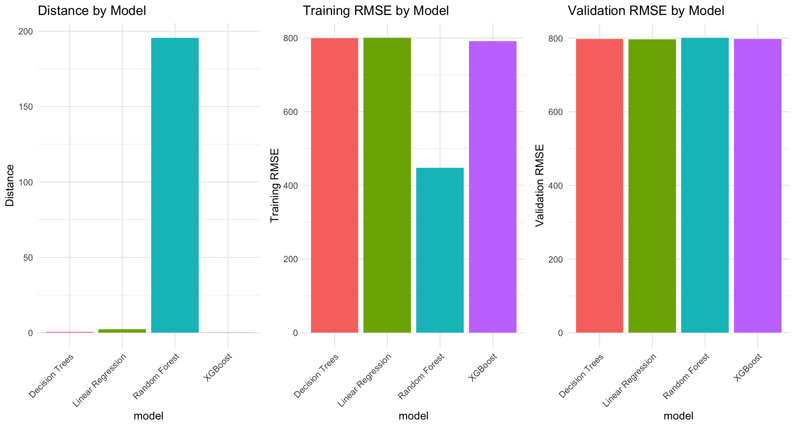

```{r setup, include=FALSE}
knitr::opts_chunk$set(eval = FALSE)  # Disable execution for all chunks
```

# Introduction

Competition in this world helps people improve. In AI, it's really important because you can have a model with an accuracy score that can be enhanced by someone else.

Six months ago, [Data Afrique Hub](https://www.linkedin.com/company/dataafrique-hub/posts/) organised a competition called [DataTour 2024](https://www.linkedin.com/posts/dataafrique-hub_datatour2024-datascience-compaeztition-activity-7259100505186930688-xrpD/?utm_source=share&utm_medium=member_desktop&rcm=ACoAAAnIIdwBo7A_XNjJsfhVCRtfX3molIhpMwQ). The competition was hosted online, and people from Africa were allowed to participate as a team of up to 3 members. The chart below shows you the representation of the different countries that attended the 1st DataTour competition.

::: {style="text-align: center; width: 100%;"}
{width="100%"}
:::

The competition focused on identifying the top model for forecasting solar energy production in Africa. It began on April 11, 2024, when participants received an email with a link to the challenge details <https://colab.research.google.com/drive/1xZlHkHcf3TgMFJZkQ2I49Cv1QsyEPNmr>.

For this competition, we have access to three datasets: train.csv is the training dataset for developing an energy demand prediction model test.csv is the validation dataset to adjust the model with a precision from the organizer  submission.csv is the submission dataset (which does not contain the target variable) that competitors must use when they are confident in their best model, to evaluate its worth compared to other competitors' models.

After running your best model on the submission dataset, you obtain predictions for that dataset. You then submit the line ID from the submission dataset along with the generated predictions. The entire submission is made as a CSV file to a Google Form available at this link <https://docs.google.com/forms/d/e/1FAIpQLSeachx3qZG-E_MGtFqprA53SC32XOJb9A6JjRz-HI1-m1nPew/closedform> Once submitted, your score is posted in this Google Sheet <https://docs.google.com/spreadsheets/d/1yof-YEkKflmSuYaDhBxcQz_hb2eiJupuq90lBgfFJTY/edit?gid=0#gid=0>, though not instantly. For this first edition, several processes weren't automated yet, but everything was functioning properly. After about 30 minutes, the file was refreshed with the score from your latest submission and your updated rank.

The objective of the first phase was to become the top team in your country. There were only two phases in total. The second phase would include only the leading team from each country. After two weeks of numerous submissions, the first round closed on November 17 at 23h GMT, revealing the teams eligible to participate in the second phase.

I failed to pass the first tour of that competition; I ended 82nd. Within the framework of this EDX project, I decided to re-implement the project differently using R and tidyverse models.

# Dataset

The provided dataset consists of three files:

-   **Training**: a CSV file with 150,000 rows, containing all features, including the target feature demande_energetique_projectee. This dataset is intended for training the model and is available at <https://raw.githubusercontent.com/dataafriquehub/energy_data/refs/heads/main/train.csv>.

-   **Testing**: a CSV file with 62,500 rows, containing all features, including the target feature demande_energetique_projectee. This dataset is used to adjust and evaluate the model's performance before the final submission and is available here <https://raw.githubusercontent.com/dataafriquehub/energy_data/refs/heads/main/test.csv>.

-   **Submission**: a CSV file with 25,000 rows, containing all features except the target feature demande_energetique_projectee. This dataset is used to generate the final prediction and is available at <https://raw.githubusercontent.com/dataafriquehub/energy_data/refs/heads/main/submission.csv> (the link to the target feature values is provided at the end).

Here is the description of the different features:

| Feature | Description |
|----|----|
| `country` | The country where the region is located. |
| `lat`, `lon` | Latitude and longitude of the region, allowing analysis of geographical conditions. |
| `population` | Regional population, an indicator of potential energy demand. |
| `taux_ensoleillement` | Average annual sunshine rate, indicating the region's solar potential. |
| `demande_energetique_actuelle` | The region's current energy demand. |
| `demande_energetique_projectee` | **Target feature** – Projected energy demand for the region (to be predicted in the submission file). |
| `capacite_installee_actuelle` | Current energy capacity installed in the region. |
| `duree_ensoleillement_annuel` | Average number of hours of sunshine per year, influencing solar production potential. |
| `cout_installation_solaire` | Average cost of installing solar infrastructure in the region. |
| `proximite_infrastructures_energetiques` | Distance to existing energy infrastructure, influencing access to energy. |
| `taux_adoption_energies_renouvelables` | Percentage of population using renewable energies. |
| `stabilite_politique` | Political stability score, a factor that can affect energy investments. |
| `taux_acces_energie` | Percentage of the population with current access to energy. |
| `niveau_urbanisation` | Level of urbanization in the region, linked to infrastructure and energy demand. |
| `potentiel_investissement` | Indicator of potential interest in energy investments in the region. |
| `types_sols` | Type of ground in the region, which can affect the feasibility of solar infrastructures. |
| `emissions_co2_evitees` | Estimated CO$_2$ emissions avoided thanks to installed renewable energies. |
| `idh` | Human Development Index, a socio-economic factor influencing energy demand. |
| `habit_de_mariage` | Local dress tradition at weddings, included to add variety to the data. |
| `nombre_animaux_domestiques` | Average number of pets per household, included to add variety to the data. |

# Exploratory Data Analysis (EDA)

As always, we begin with exploratory data analysis (EDA) to gain an understanding of the data at hand. First, we check the size of the different datasets.

```{r}
dim(train)      # [1] 150000   21
dim(test)       # [1] 62500    21
dim(submission) # [1] 25000    20
```

They match the details outlined in the dataset description above.

```{r}
str(train)
# 'data.frame':	150000 obs. of  21 variables:
#   $ country                               : chr  "Zimbabwe" "Congo (Brazzaville)" "Namibia" "Somalia" ...
# $ lat                                   : num  -19.015 -0.228 -22.958 5.152 -4.038 ...
# $ lon                                   : num  29.2 15.8 18.5 46.2 21.8 ...
# $ population                            : int  14862924 5518092 2540905 15893222 89561403 13132795 988000 114963588 1160164 7976983 ...
# $ taux_ensoleillement                   : num  5 4.61 5.79 4.1 6.1 ...
# $ demande_energetique_actuelle          : num  485 1423 4711 799 2527 ...
# $ demande_energetique_projectee         : num  544 1864 5525 1448 3030 ...
# $ capacite_installee_actuelle           : num  583 164 1404 1370 962 ...
# $ duree_ensoleillement_annuel           : num  3937 3754 3805 2047 3421 ...
# $ cout_installation_solaire             : num  927 863 1299 1257 1484 ...
# $ proximite_infrastructures_energetiques: num  15.45 1.46 17.14 24.71 59.18 ...
# $ taux_adoption_energies_renouvelables  : num  14.3 41.4 41.3 21.9 37.1 ...
# $ stabilite_politique                   : num  2.58 2.75 3.09 3.64 6.57 ...
# $ taux_acces_energie                    : num  67.5 61.9 17.4 21.7 47.7 ...
# $ niveau_urbanisation                   : num  35.7 40.1 47 40.2 63.2 ...
# $ potentiel_investissement              : int  4 2 5 1 3 3 3 4 2 5 ...
# $ types_sols                            : chr  "rocheux" "sablonneux" "argileux" "rocheux" ...
# $ emissions_co2_evitees                 : num  555 3722 9824 9407 9184 ...
# $ idh                                   : num  0.442 0.38 0.678 0.731 0.357 ...
# $ habit_de_mariage                      : chr  "traditionnel" "traditionnel" "moderne" "moderne" ...
# $ nombre_animaux_domestiques            : int  2 5 0 7 2 3 2 7 1 7 ...
```

we can deduce the categorical and numerical features

-   **categorical**: `country`, `types_sols`, `habit_de_mariage`

-   **numerical**: all the other features

::: {style="text-align: center; width: 100%;"}
{width="100%"}
:::

The summary of the training dataset generated using the `st` function from the `vtable` library confirms that the categorical variables are of the `character` class. We can also notice that, there is a feature with missing values, the `taux_adoption_energies_renouvelables` feature. In the table, we observe that it has only `134864` over `150000` values, so we have `15136` values. That is around **10% of the rows**.

At this stage, we know our categorical and numerical features. Before continuing, let's clearly define them.

```{r}
categorical_features <- c("country", "types_sols", "habit_de_mariage")
numerical_features <- 
  train |> 
  select(-categorical_features) |> 
  names()
numerical_features
# [1] "lat"     "lon"      "population"                            
# [4] "taux_ensoleillement"     "demande_energetique_actuelle"      "demande_energetique_projectee"         
# [7] "capacite_installee_actuelle"     "duree_ensoleillement_annuel"     "cout_installation_solaire"             
# [10] "proximite_infrastructures_energetiques" "taux_adoption_energies_renouvelables"   "stabilite_politique"
# [13] "taux_acces_energie"     "niveau_urbanisation"     "potentiel_investissement"              
# [16] "emissions_co2_evitees"      "idh"     "nombre_animaux_domestiques" 
```

Now let's explore each of those features

## Numerical variables exploration

To get a first view of our numerical variables, let's plot each of them

```{r}
train |>
  select(numerical_features) |>
  gather() |>
  ggplot(aes(value)) + geom_histogram() + 
    facet_wrap(~key, nrow = 5, ncol = 4, scales = "free")
```

::: {style="text-align: center; width: 100%;"}
{width="100%"}
:::

The first thing, we can observe is that `nombre_animaux_domestiques` and `potentiel_investissement` are not numerical but categorical variables.

Let's update our list of categorical and numerical features

```{r}
categorical_features <- c(
  "country", "types_sols", "habit_de_mariage", 
  "nombre_animaux_domestiques", "potentiel_investissement"
)
numerical_features <- 
  train |> 
  select(-categorical_features) |> 
  names()
numerical_features
# [1] "lat"     "lon"   "population"
# [4] "taux_ensoleillement"     "demande_energetique_actuelle"      "demande_energetique_projectee"
# [7] "capacite_installee_actuelle"     "duree_ensoleillement_annuel"     "cout_installation_solaire"
# [10] "proximite_infrastructures_energetiques" "taux_adoption_energies_renouvelables"   "stabilite_politique"
# [13] "taux_acces_energie"     "niveau_urbanisation"     "emissions_co2_evitees"
# [16] "idh"
```

One next step will be to check the correlation between numerical variable and the target `demande_energetique_projectee` feature

::: {style="text-align: center; width: 100%;"}
{width="100%"}
:::

We notice, from the correlation matrix, that the only high correlation, the one close to 1, is the correlation between `demande_energetique_actuelle` and the target feature `demande_energetique_projettee`. All the other correlations are close to 0.

In conclusion, of 15 numerical features, only one is dependent and correlated to the target. As the feature `demande_energetique_actuelle` is neither a leakage nor a duplicate of the target feature, we will keep it. For the other 14 features, the near-zero correlation can make us think about

-   non-linear relationship with the target features
-   the existance of interaction effects which can be helpful in creating new in feature engineering step
-   the existence of confounding factors or data errors

## Feature engineering

From the plot above, most of the features have uniform data to which no transformation is needed. Let's calculate the **skewness** to detect the feature that needs to be transformed easily.

```{r}
train |> 
  select(numerical_features) |>
  moments::skewness(na.rm = TRUE) |>
  as.data.frame()

#             moments::skewness(select(train, numerical_features), na.rm = TRUE)
# lat                                                           -0.3404096052
# lon                                                           -0.1602952184
# population                                                    3.0299898435
# taux_ensoleillement                                           0.0012632486
# demande_energetique_actuelle                                  -0.0018997061
# demande_energetique_projectee                                 0.2866971414
# capacite_installee_actuelle                                   0.0014673225
# duree_ensoleillement_annuel                                   0.0005891623
# cout_installation_solaire                                     0.0023512914
# proximite_infrastructures_energetiques                        0.0011824656
# taux_adoption_energies_renouvelables                          0.0002865192
# stabilite_politique                                           -0.0011017794
# taux_acces_energie                                            0.0004906154
# niveau_urbanisation                                           -0.0056380559
# emissions_co2_evitees                                         0.0077048958
# idh                                                           0.0001517014
```

From the table above, the only feature that needs to be transformed is the `population`, and because its skewness is higher than 0, the transformation to apply will be a logarithm.

## Missing data

The last thing to fix is the missing values of the `taux_adoption_energies_renouvelables`. To determine how to address it, let's first examine the number of missing values per country.

```{r}
train %>% group_by(country, lat, lon) %>% 
  summarize(na = sum(is.na(taux_adoption_energies_renouvelables)),
            n = n(),
            na_ratio = na/n,
            .groups = 'drop')
# # A tibble: 53 × 6
# country                     lat    lon    na     n na_ratio
# <chr>                     <dbl>  <dbl> <int> <int>    <dbl>
#   1 Algeria                   28.0    1.66   262  2759   0.0950
# 2 Angola                   -11.2   17.9    282  2861   0.0986
# 3 Benin                      9.31   2.32   298  2850   0.105 
# 4 Botswana                 -22.3   24.7    299  2785   0.107 
# 5 Burkina Faso              12.2   -1.56   286  2892   0.0989
# 6 Burundi                   -3.37  29.9    253  2843   0.0890
# 7 Cameroon                   3.85  11.5    298  2877   0.104 
# 8 Cape Verde                16.5  -23.0    289  2863   0.101 
# 9 Central African Republic   6.61  20.9    294  2846   0.103 
# 10 Chad                      15.5   18.7    290  2927   0.0991
# # 43 more rows
# # Use `print(n = ...)` to see more rows
#
# almost same number of na per country
```

We notice that there is almost the same number of missing values per country. We will replace the missing values per country by the global mean.

The transformation of `population` and imputation of missing values in `taux_adoption_energies_renouvelables` will be done in the tidyverse's recipe.

## Categorical variables exploration

Let's continue by plotting the distribution of each categorical feature.

```{r}
train |>
  select(categorical_features) |>
  mutate(
    nombre_animaux_domestiques = as.factor(nombre_animaux_domestiques),
    potentiel_investissement = as.factor(potentiel_investissement)
  ) |>
  pivot_longer(cols = everything(), names_to = "variable", values_to = "category") |>
  ggplot(aes(x = category, fill = variable)) + geom_bar()  + 
    facet_wrap(~variable, ncol = 1, scales = "free") +
    theme_minimal() +
    theme(axis.text.x = element_text(angle = 90, vjust = 0.5, hjust=1))
```

::: {style="text-align: center; width: 100%;"}
{width="100%"}
:::

From the plot of our five categorical variables, we are tempted to wonder if they are essential for our model. Why? Because there is no variability in those five charts. The different factors or levels of each categorical variable are equally represented. We are facing a uniform distribution.

Before saying that they are not important, we should plot it according to the target feature `demande_energetique_projectee`, and a good plot to check how categorical features affect numerical features is a boxplot.

```{r}
train |>
  select(categorical_features, demande_energetique_projectee) |>
  mutate(
    nombre_animaux_domestiques = as.factor(nombre_animaux_domestiques),
    potentiel_investissement = as.factor(potentiel_investissement)
  ) |>
  pivot_longer(cols = categorical_features, names_to = "variable", values_to = "category") |>
  ggplot(aes(x = category, y = demande_energetique_projectee, fill = variable)) + geom_boxplot() +
  facet_wrap(~variable, ncol = 1, scales = "free") +
  theme_minimal() +
  theme(
    axis.text.x = element_text(angle = 90, vjust = 0.5, hjust=1),
    strip.text = element_text(size = 10, face = "bold")
  )
```

::: {style="text-align: center; width: 100%;"}
{width="100%"}
:::

Same observation, uniform distribution. A final thing we can do is an ANOVA test, which we tells us if categorical features affect the target features.

```{r}
cat_anova <- aov(
  demande_energetique_projectee ~ 
    country + habit_de_mariage + types_sols + 
    nombre_animaux_domestiques + potentiel_investissement, 
  data = train)
summary(cat_anova)
#                                 Df    Sum Sq Mean Sq F value Pr(>F)
# country                        52 2.410e+08 4635417   0.873  0.730
# habit_de_mariage                1 3.522e+05  352246   0.066  0.797
# types_sols                      2 6.290e+06 3144929   0.592  0.553
# nombre_animaux_domestiques      1 4.837e+06 4837120   0.911  0.340
# potentiel_investissement        1 3.019e+05  301874   0.057  0.812
# Residuals                  149942 7.964e+11 5311333    
```

**NO CATEGORICAL FEATURE** has a P-value lower than 0.05. In conclusion, NO CATEGORICAL FEATURE affects the target feature `demande_energetique_projectee`.

From those results, it appears that these categorical features are not crucial for our model. We will remove them when building the recipe.

# Modeling

## Process

### Modeling Approach: Comparison of Machine Learning Algorithms

The modeling process will involve comparing several machine learning algorithms: **Linear Regression, Decision Trees, Random Forest, and XGBoost**.

Each model will undergo **hyperparameter tuning** using the following approach:

-   **Training**: Train the model on each set of hyperparameters using the **training dataset**.
-   **Evaluation**: Assess the trained model’s performance on the **validation (test) dataset**.

For each algorithm, the **best model** will be selected based on the **validation loss (RMSE)**. The optimal model is determined by identifying a **U-shaped pattern** in the plot of training and validation losses.

### Hyperparameter Tuning holdout validation set

Hyperparameter tuning will be performed using a **holdout validation set** (not cross-validation), as we already have predefined training and validation datasets. For each hyperparameter set:

-   The model is trained on the training dataset, and the training loss (RMSE) is computed.
-   The validation loss is then calculated using the fixed validation dataset.

Next, we plot both the **training loss** against the **validation loss** in a scatter plot. This plot helps reveal when the model is:

-   Underfitting (high training and validation loss),
-   Overfitting (low training loss but increasing validation loss), or
-   Learning effectively (both losses decreasing).

The goal is to locate the **U-shaped curve**. The **minimum point** of this curve corresponds to the best model, where:

-   The initial decrease in validation loss indicates the model is learning.
-   The subsequent increase signals overfitting.

For tracking we are using **MLflow**. It helps us to track the parameters used to train the model during each tuning process and also the metrics obtained, that is the **training RMSE** and the **validation RMSE**.

The curve can show us the minimum point but to get it we have to compute the distance between each run and the line `y = x`. As to decide which run in the hyper-parameters tuning is the best we are plot a scatterplot of **training RMSE** versus **validation RMSE**, we best way to decide which run is the best way is to compare each each point in our curve with the **most optimal** result we should have, which **the training error equal to the validation error** which can be represented by **the line `y = x`**. The point with the smallest distance to the line is the best run with the best parameters.

### Final Model Selection and Prediction

For each algorithm, the best model is selected based on the above criteria. The **top-performing** model across all algorithms is then:

1.  Retrained on the combined training + validation datasets.
2.  Used to predict the target variable for the submission dataset.

### Common functions

```{r}
run_tuning <- function(runName, grid, wf, train, test) {
  mlflow_start_run()
  mlflow_set_tag("mlflow.runName", runName)

  param_cols <- colnames(grid)
  
  results <- grid %>%
    mutate(
      metrics = pmap(
        .l = grid, # transpose(across(all_of(param_cols))),
        .f = function(...) {
          params <- list(...)
          mlflow_start_run(nested = TRUE)
          on.exit(mlflow_end_run())

          walk2(names(params), params, ~ mlflow_log_param(.x, .y))

          fitted <- wf %>%
            finalize_workflow(params) %>%
            fit(data = train)
          
          test_preds <- predict(fitted, test) %>% bind_cols(test)
          train_preds <- predict(fitted, train) %>% bind_cols(train)
          
          test_rmse <- rmse(test_preds, truth = demande_energetique_projectee, estimate = .pred)
          train_rmse <- rmse(train_preds, truth = demande_energetique_projectee, estimate = .pred)
          
          mlflow_log_metric("test_rmse", test_rmse$.estimate)
          mlflow_log_metric("train_rmse", train_rmse$.estimate)
          
          c(train = train_rmse$.estimate, valid = test_rmse$.estimate)
        }
      )
    )
  
  mlflow_end_run()
  
  results %>%
    mutate(
      train_rmse = map_dbl(metrics, "train"),
      valid_rmse = map_dbl(metrics, "valid")
    ) %>%
    select(-metrics)
}
```

The `run_tuning` function will run the hyper-parameters tuning for an algorithm.

```{r}
get_mlflow_run_details <- function(runName) {
  experimentId <- mlflow_get_experiment()$experiment_id
  
  parentRun <- 
    mlflow_search_runs(filter = paste0("tags.mlflow.runName = '", runName, "'"), experiment_ids = experimentId)
  
  if (nrow(parentRun) == 0) stop("No run found with that name")
  
  childrenRuns <- 
    mlflow_search_runs(
      filter = paste0("tags.mlflow.parentRunId = '", parentRun$run_id[1], "'"),
      experiment_ids = experimentId,
      run_view_type = "ALL"
    ) |>
    select(-c(run_uuid, status, experiment_id, user_id, artifact_uri, lifecycle_stage, tags))

  return(childrenRuns)
}
```

`get_mlflow_run_details` will fetch all the runs from MLflow for an algorithm.

```{r}
distance_from_yx <- function(runs) {
  distances <-
    runs |>
    select(run_name, metrics) |> 
    unnest(metrics) |> 
    select(-c(timestamp, step)) |> 
    pivot_wider(names_from = "key", values_from = "value") |>
    mutate(
      distance = abs(train_rmse - test_rmse)/sqrt(2)
    ) |>
    arrange(distance)
  
  return(distances)
}

plot_distances_bar <- function(distances) {
  distances |>
    head(20) %>%
    ggplot(aes(x = reorder(run_name, distance, decreasing = TRUE), y = distance)) +
    geom_bar(stat = "identity", fill = "#69b3a2") +
    coord_flip() +
    labs(title = "Top 20 Runs by Distance from y = x",
         x = "",
         y = "Distance from perfect generalization") +
    geom_text(aes(label = round(distance, 4)), hjust = -0.1, size = 3) +
    theme_minimal()
}
```

`distance_from_yx` and `plot_distances_bar` are the functions that will respectively compute the distance of a run from `y = x` and plot a bar chart of each run against the distance (for the 20 best runs).

```{r}
get_best_model_parameters <- function(distances, runs) {
  params <- 
    runs |> 
    filter(run_name == distances$run_name[1]) |> 
    select(params) |> 
    pull(params)

  params_named <- setNames(as.list(params[[1]]$value), params[[1]]$key)
  
  best_params <- as_tibble(as.list(params_named))
  
  return(best_params)
}
```

Finally, `get_best_model_parameters` will get the best model parameters from the computed distances obtained from the previous function.

## Data Preprocessing Recipe

We implement our data preprocessing steps using the recipes package in R, which provides a systematic and reproducible approach to feature engineering. The pipeline performs the following transformations on our training data:

1.  **Target and Predictors specification**: Specifying `demande_energetique_projectee` as the target variable and all other columns serving as predictors.
2.  **Type Conversion**: Converting the `population` variable to a numeric format to ensure proper mathematical operations.
3.  **Feature selection**: After runing ANOVA test on categorical variables, we have noticed that they are not important for this forecasting. So, we have to identify and remove categorical features (stored in `categorical_features`).
4.  **Missing Values**: Handles NA values in `taux_adoption_energies_renouvelables` by imputing the mean value.
5.  **Feature scaling**: Standardizes all numeric predictors to have zero mean and unit variance for optimal model performance.

The complete preprocessing pipeline is implemented as follows:

```{r}
basic_recipe <- 
  recipe(demande_energetique_projectee ~ ., data = train) |> 
  step_mutate(population = as.numeric(population)) |>
  update_role(all_of(categorical_features), new_role = "removed") |>
  step_rm(has_role("removed")) |>
  step_impute_mean(taux_adoption_energies_renouvelables) |>
  step_normalize(all_numeric_predictors())
```

To inspect the transformed training data, we execute:

```{r}
basic_recipe |>
  prep() |>
  bake(new_data = NULL)
```

A key advantage of the `recipes` framework is its ability to consistently apply the same preprocessing transformations to subsequent datasets (validation and submission) without manual intervention. This ensures complete reproducibility and prevents data leakage, as all transformations are encapsulated in a single pipeline object.

## Logistric Regression

Always start with a simple model! That's why the first one we use is the Linear Regression.

Actually, We began with a standard **Elastic Net** regression model using `glmnet`, implementing:

```{r}
lr_model <- linear_reg(
  penalty = tune(),  # Regularization strength
  mixture = tune()   # Elastic Net mixing parameter (0=Ridge, 1=Lasso)
) %>%
  set_engine("glmnet") %>%
  set_mode("regression")
```

The workflow incorporated our preprocessing recipe and performed hyperparameter tuning across:

-   Penalty values
-   Mixture values

```{r}
lr_grid <- grid_latin_hypercube(
  penalty(range = c(10^-4, 10^0), trans = log10_trans()),
  mixture(),
  size = 50
)
```

These parameters allows us to also perform checking on **Ridge** regression and **Lasso** regression which are two variants of classical linear regression that add regularization to control model complexity and prevent overfitting.

The parameters list set, we can then run the hyperparameter-tuning, and with MLflow track, at each turn, the different parameters and the relative metrics

```{r}
lr_wf <- workflow() %>%
  add_model(lr_model) %>%
  add_recipe(basic_recipe)

lr_tuned <- run_tuning("Linear Regression", lr_grid, lr_wf, train, test)
```

In our approach, we plot a scatter plot of Train RMSE VS Validation RMSE to find the best model from the U-shape. For our first algorithm, the plot is the one below.

::: {style="display: flex; justify-content: center; gap: 10px;"}


:::

At the left, it's the result from the tuning process and at the right, we have the zoomed of the circled points from the left. The right images show us the U-shape from the tuning process.

We follow this following process to find the best model parameter

```{r}
# We get the runs
lr_runs <- get_mlflow_run_details("Linear Regression")

# We compute the distance from each run to the line y = x 
lr_distance <- distance_from_yx(lr_metrics)

# We plot the results
plot_distances_bar(lr_distance)
```

::: {style="display: flex; justify-content: center;"}

:::

So, The best run is `indecisive-swan-202` with a distance from `y = x` equal to **2.3697**.

Finally, we can extract our best model parameters

```{r}
lr_best_model <- get_best_model_parameters(lr_distance, lr_runs)
lr_best_model
# penalty    mixture
#      <dbl>      <dbl>
# 1.039792 0.03966971
```

Here are the metrics obtained from that best model

-   **Train RMSE**: 800.0921
-   **Validation RMSE**: 796.7408

## Decision tree

As with Linear Regression, we began with a broad search across three key parameters using Latin Hypercube Sampling:

```{r}
tree_model <- decision_tree(
    cost_complexity = tune(),  # Complexity parameter (cp)
    tree_depth = tune(),       # Maximum tree depth
    min_n = tune()             # Minimum observations per node
  ) %>%
  set_engine("rpart") %>%
  set_mode("regression")

tree_grid <- grid_latin_hypercube(
    cost_complexity(range = c(-6, -1)),
    tree_depth(range = c(1, 30)), 
    min_n(range = c(2, 40)),
    size = 50
  )
```

The initial search covered wide ranges:

-   Cost complexity: 10\^-6 to 10\^-1 (log scale)
-   Tree depth: 1 to 30 levels
-   Minimum node size: 2 to 40 observations

With that grid, we can start finding the best model

```{r}
tree_wf <-
  workflow() %>%
  add_model(tree_model) %>%
  add_recipe(basic_recipe)
  
tree_tuned <- run_tuning("Decision Trees", tree_grid, tree_wf, train, test)
```

The scatter plot obtain from MLflow to compare the train RMSE with test RMSE looks like this:

::: {style="text-align: center; width: 100%;"}
{width="100%"}
:::

We can clearly observe the U shape in that plot, indicating us where the best model is. By zooming at minimum value of the plot, we can see the run indicating us the best model

We follow the same process than for Linear Regression to get the best model parameters

```{r}
tree_runs <- get_mlflow_run_details("Decision Trees")

tree_distance <- distance_from_yx(tree_runs)

plot_distances_bar(tree_distance)
```

::: {style="display: flex; justify-content: center;"}

:::

So, The best run is `judicious-kite-512` with a distance from `y = x` equal to **0.4939**.

Finally, we can extract our best model parameters

```{r}
tree_best_params <- get_best_model_parameters(tree_distance, tree_runs)
tree_best_params
# min_n tree_depth cost_complexity
# <dbl>      <dbl>           <dbl>
# 40         24   0.00002451480
```

Here are the metrics obtained from that best model

-   **Train RMSE**: 799.9306
-   **Validation RMSE**: 799.2320

## XGBoost

As usual, we start doing hyper-parameter tuning, with this list of six key parameters.

```{r}
xgb_model <- 
  boost_tree(
    trees = tune(),          # Number of trees
    tree_depth = tune(),     # Max tree depth
    learn_rate = tune(),     # Learning rate (eta)
    mtry = tune(),           # Variables per split
    min_n = tune(),          # Min observations in terminal nodes
    loss_reduction = tune()  # Gamma (min loss reduction)
  ) %>%
  set_engine("xgboost") %>%
  set_mode("regression")

xgb_grid <- grid_latin_hypercube(
  trees(range = c(100, 2000)),
  tree_depth(range = c(3, 15)),
  learn_rate(range = c(-2, -1)),  # 0.01 to 0.1
  mtry(range = c(1, 10)),      # Features per split
  min_n(range = c(5, 20)),     # Min node size
  loss_reduction(),            # Gamma parameter
  size = 50
)
```

Key ranges explored:

-   Number of trees: 100-2000
-   Tree depth: 3-15 levels
-   Learning rate: 0.01-0.1 (log scale)
-   Features per split: 1-10
-   Minimum node size: 5-20
-   Minimum loss reduction: Full range

After identifying promising parameter ranges, we can run the tuning process

```{r}
xgb_wf <- 
  workflow() %>%
  add_recipe(basic_recipe) %>%
  add_model(xgb_model)

xgb_tuned <- run_tuning("XGBoost", xgb_grid, xgb_wf, train, test)
```

Thank to MLflow, we track the different parameters and our two metrics. We then plot, as we previous model, a scatter plot of Train RMSE VS Validation RMSE.

::: {style="display: flex; justify-content: center; gap: 10px;"}


:::

We can clearly observe a U shape. The zoom version at the right show it clearly. We can then point the best model and also see its relative parameters and Train and Validation RMSE.

We follow the same process as with the previous ones to get the best model parameters

```{r}
xgb_runs <- get_mlflow_run_details("XGBoost")

xgb_distance <- distance_from_yx(xgb_runs)

plot_distances_bar(xgb_distance)
```

::: {style="display: flex; justify-content: center;"}

:::

So, The best run is `nervous-dove-881` with a distance from `y = x` equal to **0.1602**.

Finally, we can extract our best model parameters

```{r}
xgb_best_params <- get_best_model_parameters(xgb_distance, xgb_runs)
xgb_best_params
# loss_reduction  mtry min_n trees learn_rate tree_depth
#         <dbl> <dbl> <dbl> <dbl>      <dbl>      <dbl>
# 2.819773e-7     9     6   168 0.02644181          4
```

Here are the metrics obtained from that best model

-   **Train RMSE**: 799.1636
-   **Validation RMSE**: 799.3902

## Random Forest

As usual, we start doing hyper-parameter tuning, with this list of six key parameters.

```{r}
rf_model <- 
  rand_forest(
    mtry = tune(),
    trees = tune(),
    min_n = tune()
  ) |>
  set_mode("regression") |>
  set_engine("ranger")

rf_grid <-
  grid_space_filling(
    mtry(range = c(1, 10)),
    trees(range = c(100, 1000)),
    min_n(range = c(2, 20)),
    size = 50
  )
```

Key ranges explored: - `mtry`: 1 to 10 features per split - `trees`: 100 to 1000 in the forest - `min_n`: 2 to 20 observations per terminal node

After identifying promising parameter ranges, we can run the tuning process

```{r}
rf_wf <-
  workflow() |>
  add_model(rf_model) |>
  add_recipe(basic_recipe)

rf_tuned <- run_tuning("Random forests", rf_grid, rf_wf, train, test)
```

Thank to MLflow, we track the different parameters and our two metrics. We then plot, as we previous model, a scatter plot of Train RMSE VS Validation RMSE. ::: {style="display: flex; justify-content: center;"}  :::

It's a bit difficult, but there is a U shape.

We follow the same process as with the previous ones to get the best model parameters

```{r}
rf_runs <- get_mlflow_run_details("Random forests")

rf_distance <- distance_from_yx(rf_runs)

plot_distances_bar(rf_distance)
```

::: {style="display: flex; justify-content: center;"}

:::

So, The best run is `merciful-doe-505` with a distance from `y = x` equal to **195.5467**.

Finally, we can extract our best model parameters

```{r}
rf_best_params <- get_best_model_parameters(rf_distance, rf_runs)
rf_best_params
# mtry min_n trees
# <dbl> <dbl> <dbl>
# 1    15   504
```

Here are the metrics obtained from that best model

-   **Train RMSE**: 748.5071
-   **Validation RMSE**: 1025.052

# Conclusion

The following chart compare our models according to

-   Distance to `y = x`
-   Training RMSE
-   Validation RMSE

::: {style="display: flex; justify-content: center;"}

:::

Even though the best model during hyper-parameters tuning was selected using **Distance to `y = x`** metric, the model that we will choose for the final evaluation is selected according to the **Validation RMSE** metric.

According to that, the best approach is the **Linear Regression**. The best model parameters after tuning was

```{r}
penalty    mixture
1.039792   0.03966971
```

We, now, have to merge the training and validation data set, train a model whole that whole dataset and use the trained model on the submission dataset.

```{r}
lr_fit <-
  lr_wf |>
  finalize_workflow(lr_best_params) |>
  fit(data = full_data)

lr_submission_preds <-
  lr_fit |>
  predict(submission) |>
  bind_cols(submission) |>
  bind_cols(submission_final)

rmse(lr_submission_preds, truth = demande_energetique_projectee, estimate = .pred) |>
  as.data.frame()
```

We end with a **SUBMISSION ERROR EQUAL TO 800.614**
